# Controle remoto de robô por meio de Alexa, AWS e Raspberry Pi 3 em linguagem Python

- Instituto Federal de Santa Catarina - Câmpus Florianópolis
- Departamento Acadêmico de Eletrônica
- Curso de Engenharia Eletrônica
- Unidade curricular: Projeto Integrador III (PI3)
- Professores:
	- Daniel Lohmann
	- Robinson Pizzio
- Aluno: Vítor Faccio - vitorfaccio.ifsc@gmail.com
- Período de execução entre outubro de 2020 e abril de 2021

### Conteúdo:
- [Introdução](#introdução)
- [Proposta](#proposta)
- [Arquitetura do projeto](#arquitetura-do-projeto)
- [Componentes necessários](#componentes-necessários)
- [Bons guias iniciais](#bons-guias-iniciais)
- [Núcleos de trabalho](#núcleos-de-trabalho)
- [**PRIMEIRA ETAPA**](#primeira-etapa)
- [Criação de  _thing_  em AWS IoT](#criação-de-thing-em-aws-iot)
- [Desenvolvimento de _Skill_ Alexa](#desenvolvimento-de-skill-alexa)
- [Criação de função no AWS Lambda](#criação-de-função-no-aws-lambda)
- [Teste de conectividade entre componentes em nuvem](#teste-de-conectividade-entre-componentes-em-nuvem)
- [Falhas frequentes - _Troubleshooting_](#falhas-frequentes---troubleshooting)
- [Exploração do ambiente AWS RoboMaker e código de controle do robô](#exploração-do-ambiente-aws-robomaker-e-código-de-controle-do-robô)
- [Simulação do robô no AWS RoboMaker](#simulação-do-robô-no-aws-robomaker)

## Introdução

Este projeto foi desenvolvido como objeto de avaliação da unidade curricular PI3, compreendendo diversas etapas abordadas ao longo do semestre letivo 2020-2 do Instituto Federal de Santa Catarina (IFSC). 

A pandemia de Covid-19 iniciada em 2020 causou a proibição de aulas presenciais e o uso de laboratórios, acarretando em uma forte limitação do escopo desta atividade na questão de implementação e testes práticos. A unidade curricular PI3 tem o propósito de unir aprendizados de _software_ e _hardware_ dentro de um único projeto, porém para contornar a dependência de testes físicos complexos optou-se por um sistema mais virtual, com ênfase em comunicação e processamento em nuvem, e _hardware_ simplificado -- mas aberto a aprimoramentos futuros. 

Neste sentido surgiu a oportunidade de explorar o Amazon Web Services (AWS) e seu ambiente de desenvolvimento de robótica, o AWS RoboMaker, ainda pouco abordados no curso. O AWS é uma plataforma de desenvolvimento e computação em nuvem com os mais variados tipos de serviço, desde controle de frotas de robôs a instanciamento em larga escala de máquinas virtuais, ferramentas de _machine learning_ e análise de dados. Este aglomerado dá abertura a inúmeras possibilidades em empresas dentro e fora do ramo da tecnologia, visto que comunicação e automatização de processos com segurança digital são qualidades que podem afetar qualquer setor.

De maneira complementar, o sistema de reconhecimento de voz Alexa e uma placa Raspberry Pi foram cogitados como bons elementos para a integração de sistemas, constituindo o _frontend_ do _software_ e o _hardware_.

**Este repositório tem como função relatar os processos elaborados durante a unidade curricular mas também servir de tutorial para desenvolvedores. As etapas são descritas de forma a permitir a replicação do projeto, seguindo estratégias e _links_ disponíveis até o período de _push_, abril de 2021.**

## Proposta

-  Fazer o controle de um robô de forma remota, com comando por Alexa e acionamento elétrico em Raspberry Pi;
-   Utilização da plataforma Amazon Web Services (AWS) para comunicação entre os dispositivos;
- Executar ações de movimento do robô a partir do controle de motores elétricos ligados a rodas.  

## Arquitetura do projeto

O diagrama a seguir apresenta a arquitetura base do projeto proposto, retirada do tutorial [Build an Alexa controlled robot with AWS RoboMaker](https://aws.amazon.com/pt/blogs/robotics/build-alexa-controlled-robot/). A figura mostra os dois pontos a serem conectados nas extremidades laterais, o reconhecimento de voz por um dispositivo Alexa como o Amazon Echo e o acionamento de um robô. 


Fonte: [Build an Alexa controlled robot with AWS RoboMaker](https://aws.amazon.com/pt/blogs/robotics/build-alexa-controlled-robot/)

> O _link_ citado aborda exatamente o sistema proposto para esse projeto, porém trechos desatualizados e pequenas inconsistências de dados requerem o uso adicional de outras fontes. 

Além da _skill_ Alexa e do controle de _hardware_ observa-se as etapas de função Lambda e AWS IoT, que serão exploradas a seguir neste trabalho. Abaixo destes é vista a tarefa do desenvolvedor vinculada ao AWS RoboMaker, responsável por elaborar os códigos, testá-los e aplicá-los em _hardware_. Todas estas conexões são feitas por meio da internet em serviços da Amazon, em que os pontos compartilham suas identificações e endereços para correto envio de dados.

O _hardware_ deve ser imaginado para se determinar as funções dos códigos e os equipamentos utilizados. Como já mencionado, há uma limitação de testes práticos e uso de periféricos, que dependeriam da disponibilidade nos laboratórios do IFSC. Optou-se então por comprometer-se com a movimentação do robô, o que dependeria de motores DC ligados às rodas e _drivers_ de corrente para a conexão com a Raspberry Pi. Esta alternativa é simples mas possibilita que se verifique o funcionamento apenas com circuitos básicos de LEDs ligados à placa. Além disso, ela é de fácil implementação assim que se obtenha acesso aos recursos da instituição e coloca à prova todo o sistema de _software_ e acionamento da Raspberry.


## Componentes necessários

- Conta no AWS Educate;
	> Entre em contato com seu professor ou instituição para saber como adquirir gratuitamente uma conta de estudante. É possível que este projeto seja desenvolvível com conta comum, mas esta não foi testada e pode requerer investimento financeiro;
- Conta no Alexa Developer Console;
- Raspberry 3 B+;
	> Modelo utilizado, não restrito;
- Cartão de 8 GB ou mais com OS Ubuntu 18.04
	> A versão do sistema operacional é restrita devido à compatibilidade com _softwares_ utilizados na etapa de simulação.

## Bons guias iniciais

Este pode ser o primeiro contato do leitor com robótica, Alexa e plataforma AWS. Em tal caso sugere-se alguns guias e tutoriais gratuitos para fornecer uma boa base no início do projeto:
- [Codecademy - Learn to Program Alexa](https://www.codecademy.com/learn/learn-alexa)
	- [Build Your First Alexa Skill (SDK v2)](https://www.codecademy.com/learn/learn-alexa/modules/learn-alexa-skills-kit)
	- [Create Your Lambda Function (SDK v2)](https://www.codecademy.com/learn/learn-alexa/modules/learn-alexa-lambda)
- Tutoriais do AWS Educate - _Badges_:
	-  _AWS RoboMaker - Introduction_;
    -   _RoboMaker Course 0: Robotic Fundamentals_;
    -   _RoboMaker Course 1b: Getting Started with AWS_;
    -   _AWS RoboMaker Course 2: ROS2 and ROS_;
    -   _IoT Badge_;
    -   _Alexa Badge_.

## Núcleos de trabalho
- **Primeira etapa**:
	- Desenvolvimento de arquivos para comunicação dentro das plataformas AWS e Alexa;
    - Escrita de algoritmo de controle do robô;
    - Simulação do robô no ambiente AWS RoboMaker;
- **Segunda etapa**:
    - Instalação de softwares e bibliotecas necessárias no sistema operacional usado pelo robô;
    - Adaptação do algoritmo para uso em Raspberry Pi 3 B+;
    - Teste laboratorial.

# Primeira etapa

A primeira etapa do projeto diz respeito aos sistemas em nuvem e simulação de _hardware_. De acordo com a imagem anterior há três estágios por trás da comunicação em nuvem: AWS IoT _thing_, _skill_ Alexa e função Lambda. Estes três pontos são interdependentes para testagem, mas cada um será descrito individualmente.

## Criação de _thing_ em AWS IoT

A conexão entre os componentes do projeto é feita pela integração de todos a um IoT _thing_. Trata-se de um receptáculo com endereço URL fixo e acessível ao desenvolvedor, que reúne e redistribui dados enviados de todas as partes. 

O IoT _thing_ utiliza protocolo MQTT (_Message Queuing Telemetry Transport_) em suas mensagens. Esta estratégia é focada no envio seguro de dados pela internet com um baixo gasto de banda, ainda requerendo códigos curtos e leves por parte das máquinas. Embora não tenha havido uma pesquisa aprofundada sobre o funcionamento deste sistema, convém entendê-lo para se ter maior domínio de todas as etapas do projeto.

### Comunicação MQTT

Uma comunicação baseada em MQTT pode envolver diversos elementos. O primeiro e necessário é o _MQTT-Broker_, figura central na imagem a seguir. É o ponto que recebe e distribui as mensagens para seus devidos destinatários. Ao redor dele encontram-se todos os dispositivos conectados, que realizam duas tarefas elementares: **Publish** e **Subscribe**.


Fonte: [IT Explained: MQTT](https://www.paessler.com/it-explained/mqtt)

As funções citadas funcionam como o envio e recebimento de mensagens, mas para que possam transitar tipos diferentes de dados especifica-se um **Tópico**. O tópico age como um título, utilizado pelos _devices_ para especificar o que deve ser resgatado do _Broker_.

A função _Publish_ é utilizada quando um componente deseja enviar um pacote ao sistema sob certo tópico. Esta ação pode ser feita por uma série de motivos, como a atualização de um termômetro digital no exemplo da figura anterior. A partir do momento em que o _Broker_ recebe este dado é de sua competência entregá-lo a quem deva, o que caracteriza uma das principais qualidades desta comunicação: a segurança quanto à conexão dos dispositivos. A função _publish_ pode ser emitida por uma série de sensores dispostos em um ambiente com alta interferência como uma indústria, ou amplo e distante como uma lavoura, portanto conectar-se de forma a não exigir sinal forte e constante em todos os pontos é benéfico.

Abordando o _Subscribe_, trata-se da função usada por um componente para sinalizar ao _Broker_ que deseja receber pacotes de determinado tópico. Enquanto a função _Publish_ é requisitada a cada momento em que se deve enviar um pacote, o _Subscribe_ é enviado apenas uma vez, assim que se estabelece a conexão com o dispositivo central.

### Criação do IoT _thing_ no AWS

O AWS fornece uma plataforma de criação, hospedagem e manejo de IoT _things_, chamada AWS IoT Core. Se ainda não houve uma exploração do ambiente AWS, encontre a plataforma com os seguintes passos:
- [Acesse sua conta no AWS Educate](https://www.awseducate.com/student/s/);
- Clique em `AWS Account`, na parte superior da tela;
- Clique no botão `AWS Educate Starter Account` para acessar o _Workbench_ Vocareum;
>A tela do _Workbench_ Vocareum será visitada mais tarde para obtenção de suas credenciais, no botão `Account Details`. 
- Clique em `AWS Console` para acessar a página principal do ambiente de desenvolvimento do AWS, chamada **_AWS Management Console_** ou **Console de gerenciamento da AWS**;
- No menu `Services`, na parte superior, procure e selecione `IoT Core`. Alternativamente faça a busca na barra de pesquisa ao lado.

O processo de criação de um IoT _thing_ para este projeto não possui pontos problemáticos, pois embora possa ser customizável, não há nenhum desvio de uma criação padrão. [Este tutorial sobre MQTT e AWS IoT Core](https://aws.amazon.com/pt/premiumsupport/knowledge-center/iot-core-publish-mqtt-messages-python/) fornece um ótimo passo-a-passo. Devem ser vistas as etapas **Create an AWS IoT Core policy**, **Create an AWS IoT thing** e **Copy the AWS IoT Core endpoint URL**.

<p align="center">
    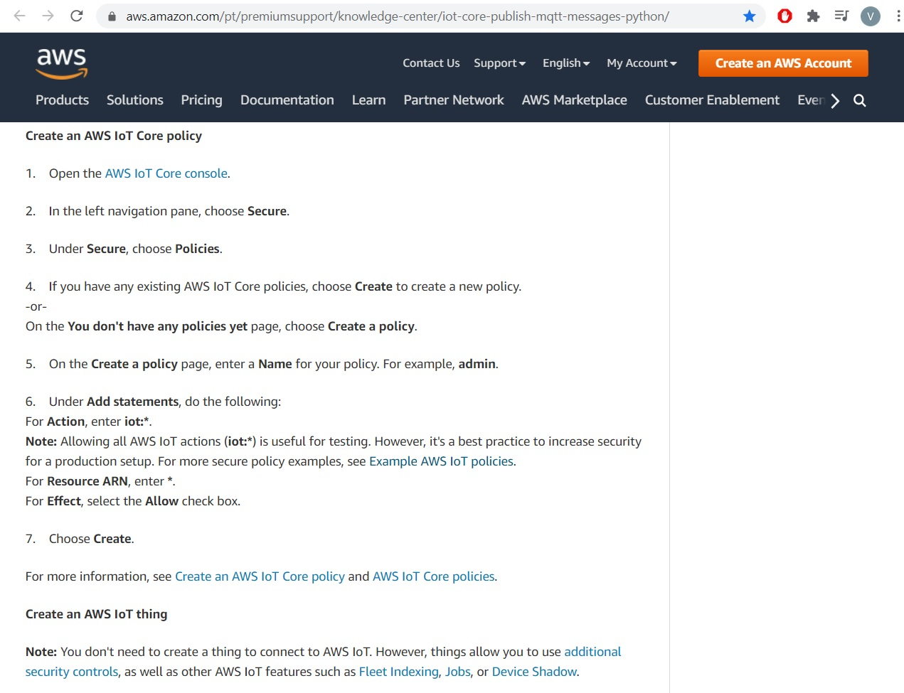
</p>

Ao fim deste processo devem estar sob domínio os seguintes itens:
- Arquivos de certificado baixados:
	- `...-certificate.pem.crt`;
	- `...-private.pem.key`;
	- `...-public.pem.key`;
- Endereço URL de _Endpoint_ do IoT _thing_ criado.

## Desenvolvimento de _Skill_ Alexa

Para se construir um robô controlado por comandos em Alexa é necessário que se tenha um reconhecimento de voz inteligente. Dispositivos Alexa devem ser capazes de identificar as palavras relacionadas a este caso específico e permitir a correta tomada de decisões. Uma _skill_ Alexa é um conjunto definido de instruções em linguagem humana a serem falados em voz alta pelo usuário final e detectados pelo dispositivo. O desenvolvedor deve considerar nesta etapa todas as ações que o robô pode tomar a cargo do usuário e como isso será comunicado, mas tanto a _skill_ quanto o Alexa Developer Console propiciam facilidade para se adaptar ou adicionar comandos no decorrer do tempo.

O procedimento a seguir é descrito [neste tutorial da Codecademy](https://www.codecademy.com/learn/learn-alexa/modules/learn-alexa-skills-kit), mas será revisto por possuir diversas questões customizáveis relativas ao projeto.

### Criação da _skill_

Tendo entrado no [Alexa Developer Console](https://developer.amazon.com/alexa/console/ask) com sua conta, a tela inicial será similar à imagem a seguir. Dê inicio aos passos:

1. Clique em `Criar Skill`.
<p align="center">
    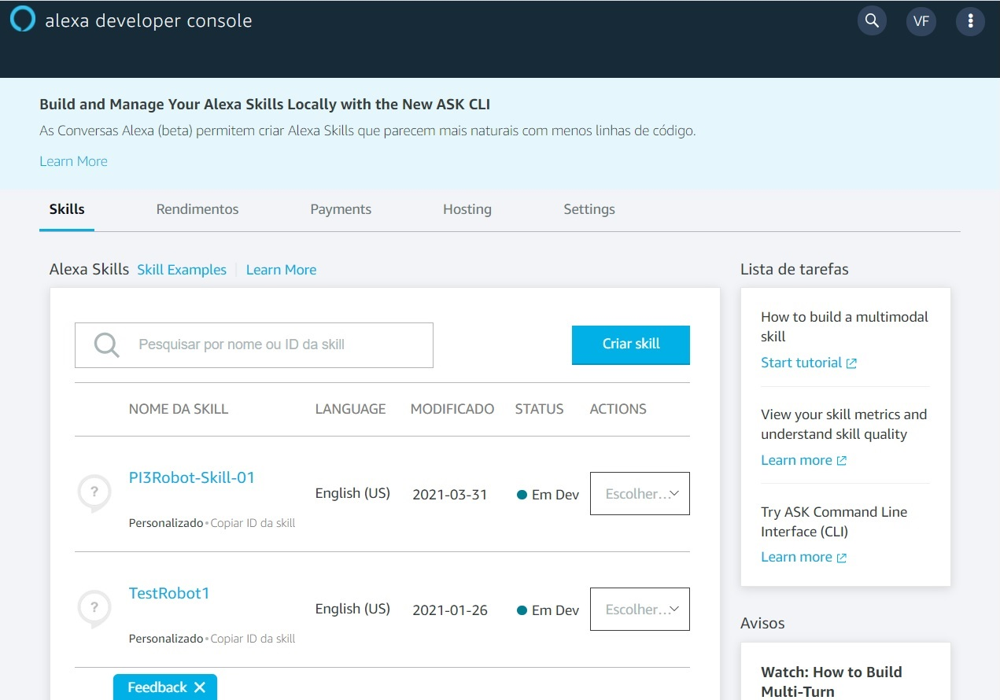
</p>

2. Preencha as seleções da primeira página:
	- **"Skill name"**: nome do conjunto de comandos utilizado no projeto. Este nome não será usado em nenhum código, mas deve ser de fácil identificação na possibilidade de a mesma pessoa trabalhar com várias _skills_ para projetos diferentes. Neste projeto utiliza-se o nome `PI3Robot-Skill-01`;
	- **"Default language"**: língua falada pelo usuário que dará o comando de voz. Deverá ser a mesma ao se definir os comandos em breve. A língua escolhida foi a inglesa, embora haja suporte para a portuguesa (PT/BR);
	- **"1. Choose a model to add to your skill"**: modelo pré-definido para dar início à _skill_. Nenhum dos oferecidos é envolvido com o projeto, portanto escolha `Custom`;
	- **"2. Choose a method to host your skill's backend resources"**:  função Lambda fornecida e hospedada pela Alexa na conta do desenvolvedor, para ser conectada à _skill_, criada automaticamente pelo console. Esta será desenvolvida individualmente no console AWS, portanto selecione `Provision your own`;
	> Embora a função Lambda seja criada posteriormente e hospedada a partir da conta AWS do estudante, seu código será  uma expansão do que o Alexa Development Console fornece no caso de se escolher a opção `Alexa-hosted (Python)`. 
	- Clique em `Create skill` no canto superior direito da tela.

<p align="center">
    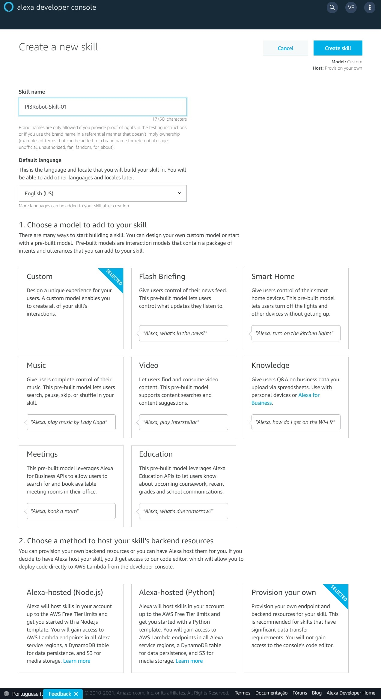
</p>

3. **"Choose a template to add to your skill"**: os comandos serão escritos do zero, portanto escolha `Start from Scratch`. Clique em `Choose` e a _skill_ será criada.

<p align="center">
    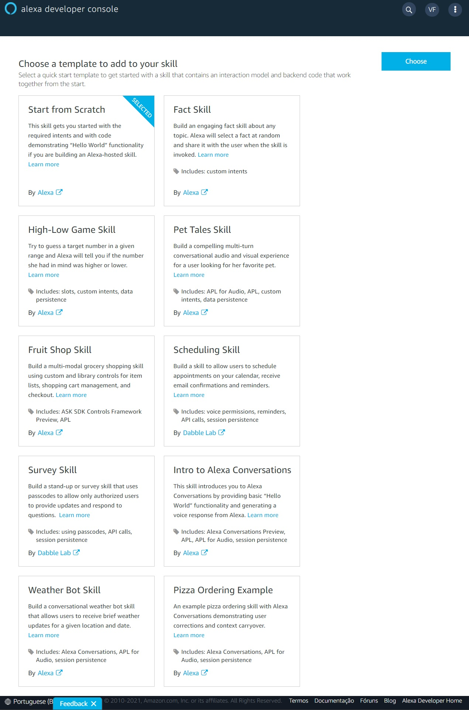
</p>

Após criar a _skill_ o console fornece uma página conforme a figura a seguir.

<p align="center">
    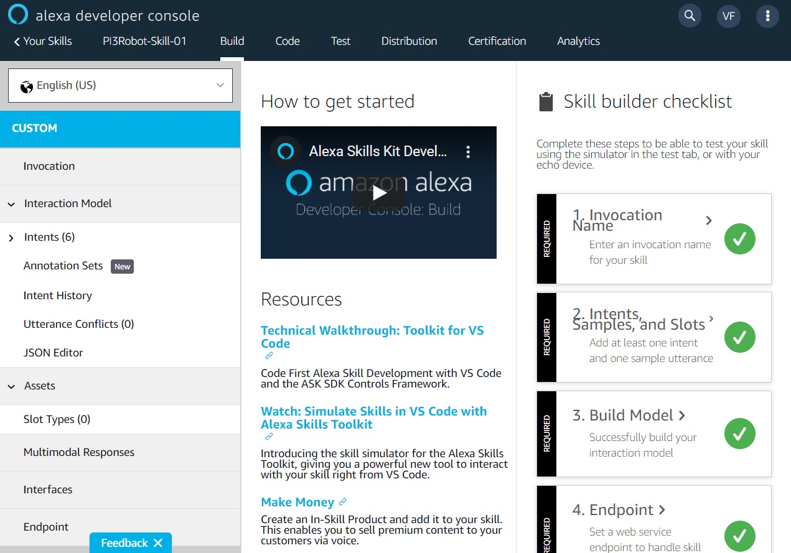
</p>

### Parâmetros e comandos da _skill_

Sendo concluída a criação da _skill_ é necessário definir as características da comunicação entre o dispositivo Alexa e o usuário. [Este tutorial da Codecademy](https://www.codecademy.com/learn/learn-alexa/modules/learn-alexa-skills-kit) explica com proficiência estes detalhes, de onde se tira a imagem a seguir.  

<p align="center">
    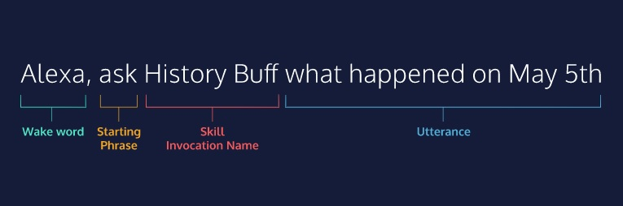
</p>

A frase ilustra o que o usuário deve falar para se comunicar com o dispositivo Alexa. São destacadas as seguintes partes com seus exemplos:

- **"Wake word"**: palavra-chave para o dispositivo começar a voz captada. Refere-se ao próprio nome `Alexa`;
- **"Starting phrase"**: início da frase, especifica qual tipo de requisição será passado. Pode ser de diferentes tipos, mas aqui será restrito ao `ask` pois será feito um "pedido" para que o robô se mova;
- **"Skill invocation name"**: Nome de invocação da _skill_. Não é o nome escolhido na etapa anterior, trata-se de um nome simples e memorável que o usuário irá falar para invocar tal _skill_. O exemplo utiliza o nome `History Buff` para chamar uma _skill_ de pesquisa de fatos históricos, mas neste projeto o usuário deve chamar pelo nome do robô;
- **"Utterance"**: especifica qual comando será buscado na _skill_ utilizada, por exemplo qual movimento será requisitado para se passar ao robô.

Estes dois últimos fatores devem ser configurados pelo desenvolvedor. O primeiro, nome de invocação da _skill_, pode ser alterado na aba **"Invocation"**, no lado esquerdo da tela. A figura a seguir mostra o caso, onde é visto também que o nome escolhido para chamar a _skill_ foi `robot one`.

<p align="center">
    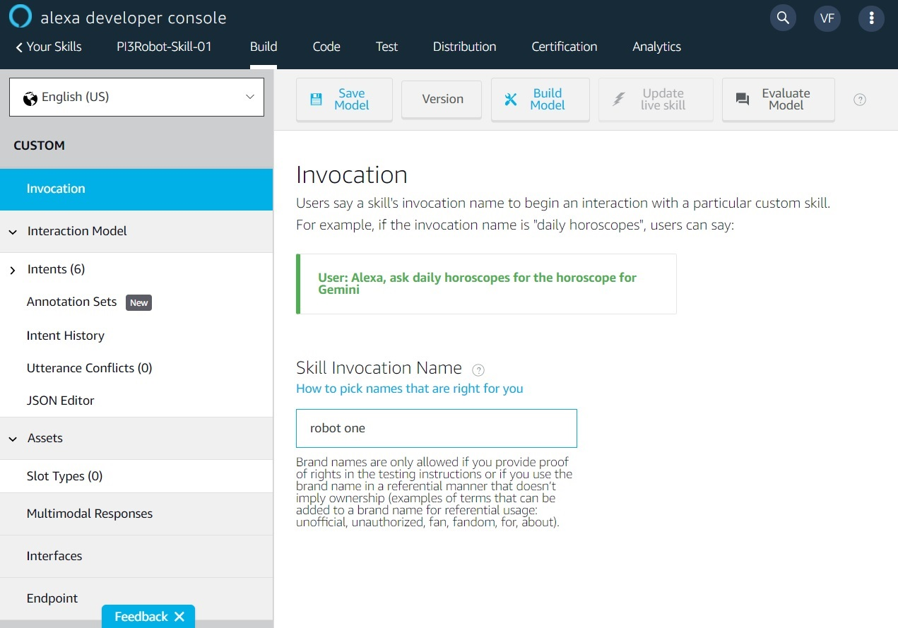
</p>

Cada possível comando passado por Alexa recebe o nome de _"Intent"_ (intenção). Deverão ser criados todos os _intents_ a se usar com o robô, portanto é necessário listar os movimentos que o sistema deverá reconhecer. Considerando que o _hardware_ terá um par de motores DC independentes controlando os lados esquerdo e direito, é possível realizar movimentos de translação frontal/traseira , com motores acionados com mesmo sentido, e rotação em torno do próprio eixo, com motores acionados em sentido contrário.

Por precisão e facilidade de uso é possível também definir funções de movimentos curtos, em que o robô inicia e para a ação em um intervalo de tempo. Define-se então a gama de comandos que o dispositivo Alexa deve reconhecer:
- Movimento para frente;
- Movimento para trás;
- Rotação horária;
- Rotação anti-horária;
- Movimento para frente por um curto período;
- Movimento para trás por um curto período;
- Rotação horária por um curto período;
- Rotação anti-horária por um curto período;

Além dos movimentos, também são necessárias duas funções adicionais:

- Parar o movimento;
- Encerrar o funcionamento do código.

A criação de _intents_ é feita a partir do menu **"Intents"** dentro da aba **"Interaction Model"**. O console fornece seis _intents_ padrão que podem ser manipulados pelo desenvolvedor, como o comando para encerrar o funcionamento do equipamento. Elas não serão utilizadas, para se manter um padrão de criação. Para inserir o primeiro _intent_ personalizado clique em `+ Add Intent`. 

<p align="center">
    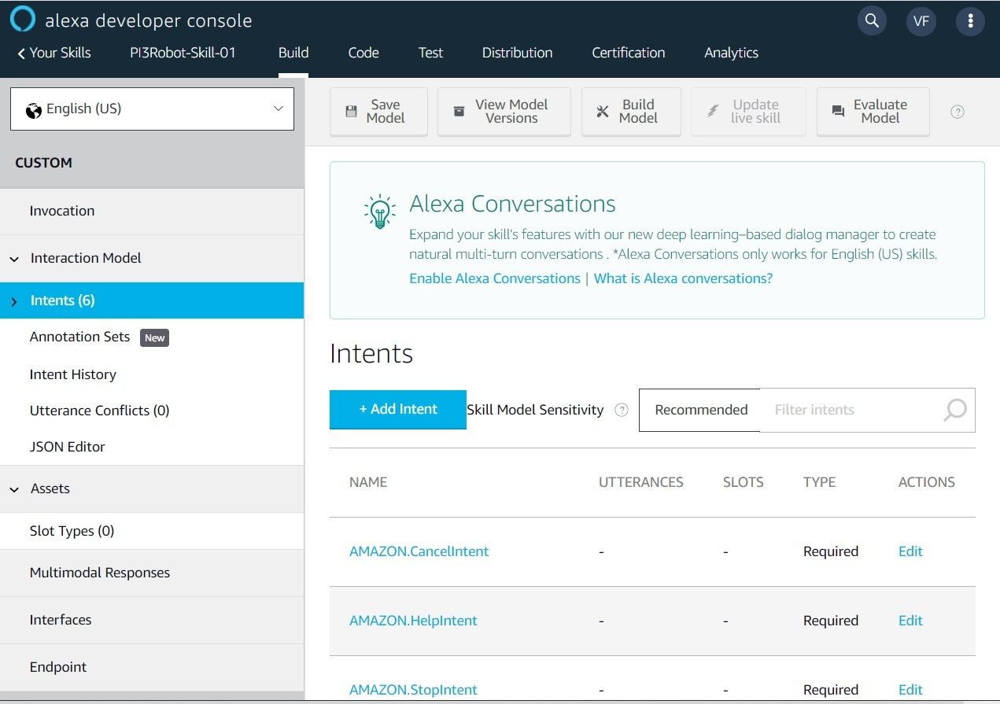
</p>

Por ser um _intent_ personalizado, sem relação com formatos pré-configurados da Alexa, deve ser escolhida a opção `Create custom intent`.  Insira um nome para a intenção em um formato sem espaços e que termine em `[...]Intent`, como `MoveForwardIntent`. Este nome será utilizado no código da função Lambda para ativar o comando de movimento curto para a frente, portanto é proveitoso utilizar nomes simples e claros, visto que serão diversos comandos. Clique em `Create custom intent`.

<p align="center">
    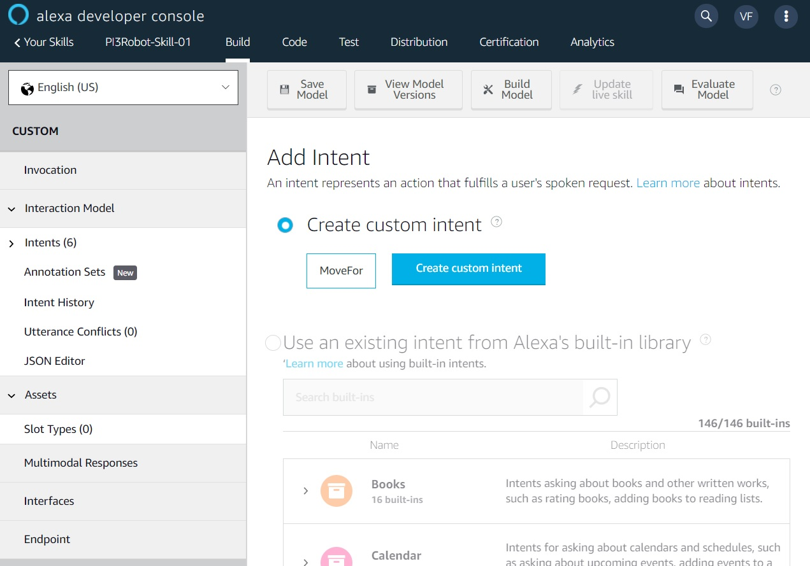
</p>

O último fator na criação de um _intent_ é o fornecimento de **"Utterances"**, ou enunciados. Eles serão palavras ditas pelo usuário ao dispositivo Alexa para informar o _intent_ desejado. Devem ser colocadas opções variadas para descrever o mesmo comportamento, abrindo opções para a comodidade para o usuário. 

Mantendo-se no exemplo do `MoveForwardIntent`, devem ser escritas expressões que se adequem ao formato da comunicação completa com o dispositivo, visto anteriormente - também cabe reiterar que deve ser utilizada a língua escolhida para esta _skill_. Insira cada possibilidade e clique Enter ou o símbolo `+` para adicionar. Ao fim, clique em `Save Model` na parte superior da tela. Os enunciados utilizados nesse caso foram:

> Alexa, ask Robot One to...
- `move forward`;
- `go forward`;
- `move straight`;
- `go straight`;
- `move front`;
- `go front`.

Esse processo deve ser repetido para todos os comandos do robô. Observa-se exemplos de _intents_ e _utterances_ para todas as funções: 


- Movimento para frente:
	- _Intent_: `MoveForwardPermanentIntent`;
	- _Utterances_: `just go`, `keep moving forward`;

- Movimento para trás:
	- _Intent_: `MoveBackwardPermanentIntent`;
	- _Utterances_: `move  backwards  indefinitely`, `retreat`;

- Rotação horária:
	- _Intent_: `TurnRightPermanentIntent`;
	- _Utterances_: `turn  right  permanently`;

- Rotação anti-horária:
	- _Intent_: `TurnLeftPermanentIntent`;
	- _Utterances_: `turn  left  indefenitely`;

- Movimento para frente por um curto período:
	- _Intent_: `MoveForwardIntent`;
	- _Utterances_: `move forward a bit`, `go straight`;

- Movimento para trás por um curto período:
	- _Intent_: `MoveBackwardIntent`;
	- _Utterances_: `move back a bit`, `return`;

- Rotação horária por um curto período:
	- _Intent_: `TurnRightIntent`;
	- _Utterance_: `spin clockwise`, `turn right`;

- Rotação anti-horária por um curto período:
	- _Intent_: `TurnLeftIntent`;
	- _Utterance_: `spin counter clockwise`, `turn left`;

- Parar o movimento:
	- _Intent_: `StopMovementIntent`;
	- _Utterances_: `stay in position`, `stop moving`.

- Encerrar o código:
	- _Intent_: `ShutdownIntent`;
	- _Utterances_: `end activity`, `shut down`.
	> O _utterance_ `shut down` pode ser apontado como conflitante entre os _intents_ `ShutdownIntent` e um padrão da _skill_, mas o console sempre dá preferência aos criados pelo desenvolvedor. 

Salve sua _skill_ clicando no botão `Save Model` na parte superior da tela.

O último ponto a se editar na _skill_ Alexa é o **"Endpoint"**. O _Endpoint_ é uma URL armazenada pela _skill_ para enviar os pedidos de _intent_. A primeira figura deste documento ilustra que a _skill_ é ligada a uma função Lambda, o que caracteriza esta conexão. Desta forma o campo de _Endpoint_ deve ser preenchido após ser terminada a próxima etapa. 

## Criação de função no AWS Lambda

A plataforma AWS Lambda é apresentada como um recurso para computação em nuvem quando há a necessidade de se acessar um algoritmo com rapidez, mas sem se preocupar com questões de hospedagem. A função Lambda age como a ponta da _skill_ Alexa, responsável pela comunicação MQTT do dispositivo com o _Broker_. Como dito na seção anterior, o Alexa Developer Console pode criar e hospedar uma função Lambda mas optou-se pelo fornecimento próprio. Foi escolhida a linguagem Python para a função Lambda, para haver um padrão entre todos os códigos desenvolvidos no projeto; a mesma será utilizada adiante no desenvolvimento do controle do robô. É possível ter _devices_ diferentes operando com linguagens Python e Node.js, mas esta estratégia não foi cogitada.

Novamente o site Codecademy fornece um bom tutorial para a etapa [neste link](https://www.codecademy.com/learn/learn-alexa/modules/learn-alexa-lambda), mas a linguagem utilizada na criação da função é Node.js. Devido a essa diferença, o processo é explorado neste projeto.

Para iniciar a criação é necessário acessar a plataforma AWS Lambda. Novamente por meio da página `AWS Console` busque a opção `Lambda`.

### Criação da função Lambda

A página geral do AWS Lambda é vista na figura a seguir. Este processo é feito na aba `Funções`, na qual a página já é iniciada.

<p align="center">
    
</p>

Após clicar em `Criar função`, selecione a opção `Explorar o repositório de aplicativos sem servidor`. Na barra de pesquisa logo abaixo, digite `alexa`.

<p align="center">
    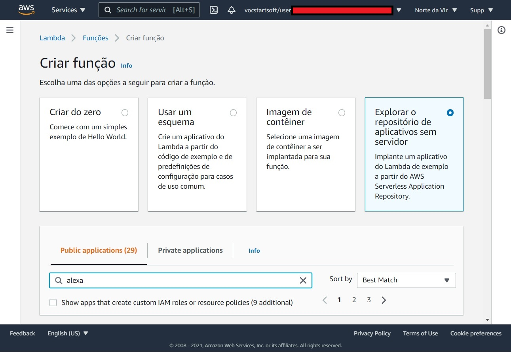
</p>

Clique em `alexa-skills-kit-python36-factskill`. Este _template_ fornece um código em Python com padrão similar ao fornecido pelo console Alexa, o que simplifica o desenvolvimento.

<p align="center">
    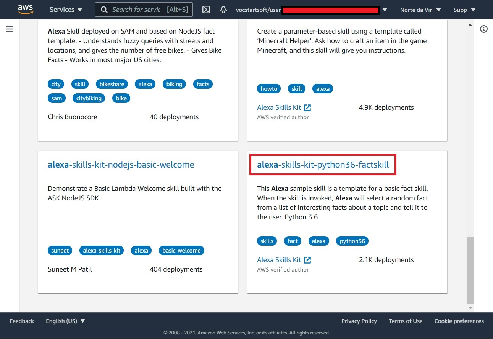
</p>

Ao fim da nova página, escreva um nome para a função no campo `SkillFunctionName`. Ele identifica a função na página inicial e será seguido de uma série de dígitos ao fim do processo. É uma opção editar também os campos `Application name` e `SkillDescription`. Escolhidos os nomes, crie a função Lambda pelo botão `Deploy`.

<p align="center">
    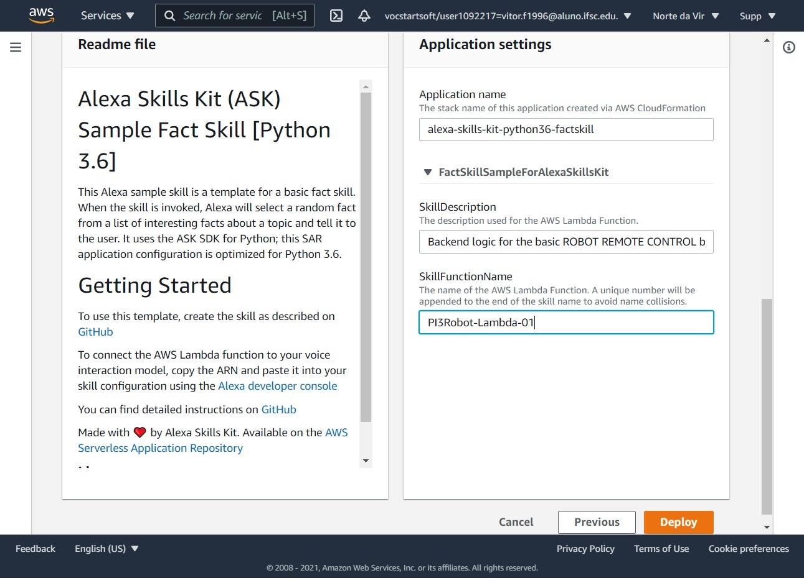
</p>

Selecione a opção destacada em `Resources` e siga para a tela da figura a seguir. A função Lambda terá sido criada.

<p align="center">
    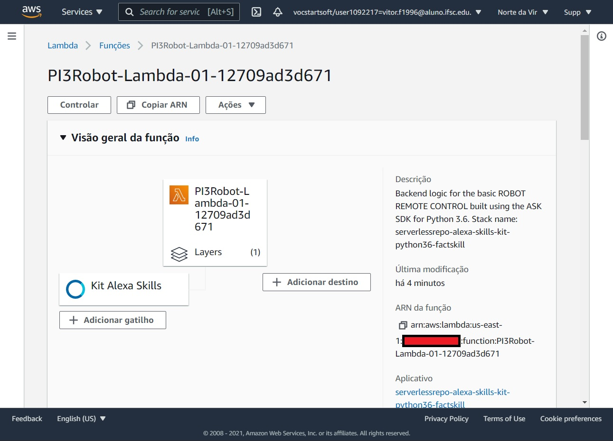
</p>

### Fornecimento de arquivos

A página da função Lambda fornece um editor de arquivos e texto para que se tenha controle sobre a atividade. Os arquivos `lambda_function.py` e `requirements.txt` são  gerados automaticamente e podem ser alterados no próprio site. Este primeiro arquivo deve ser manipulado para adequar-se à ligação com o dispositivo Alexa, pois não é este seu padrão inicial.

<p align="center">
    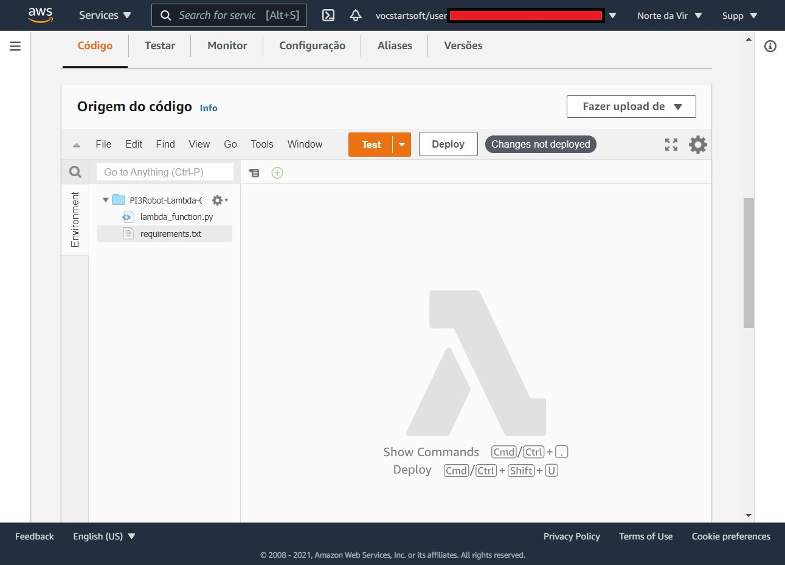
</p>

O IoT _thing_ criado anteriormente é projetado para ser seguro para desenvolvedor e usuário, impedindo que componentes alheios misturem-se à conexão por acidente ou invasão. Neste sentido é necessário ter presente em cada dispositivo os certificados criados pelo AWS IoT Core. 

Um contratempo apresentado por esse editor de arquivos é o método de _upload_, por meio do botão `Fazer upload de` . É necessário incluir os certificados e dependências do código, mas só é possível fazer o envio de arquivos `.ZIP` e o conteúdo compactado irá substituir todos os do editor. Desta forma sugere-se que se faça _upload_ de um `.ZIP` contendo tanto os certificados quanto os dois arquivos pré-existentes na função Lambda e as bibliotecas necessárias, de forma a tornar o ambiente completo. Para isso é necessário que o desenvolvedor tenha em seu computador os arquivos `.PY`, `.TXT` e dependências, analisados a seguir. Sugere-se que as alterações vistas a seguir sejam realizadas dentro de um editor de texto no próprio computador do desenvolvedor, não na ferramenta do console AWS Lambda.

### Arquivos e dependências

Todos os arquivos utilizados na função Lambda estão disponíveis na pasta [AWS Lambda](AWS%20Lambda/). Inicia-se a análise pelo _script_ principal, o arquivo `lambda_function.py`.

Este código compreende a junção de várias partes. A base do texto é a função fornecida pelo Alexa Developer Console no caso de se optar por criação de função Lambda em Python e hospedagem automáticas, comentado na seção **"Desenvolvimento de _skill_ Alexa - criação da _skill_"**. Adiciona-se os trechos recomendados pelo tutorial [Build an Alexa controlled robot with AWS RoboMaker](https://aws.amazon.com/pt/blogs/robotics/build-alexa-controlled-robot/) .

São adicionados quatro trechos em locais diferentes:
- importação da biblioteca utilizada;
- configuração dos certificados e da comunicação MQTT;
- criação de classes de _Request handlers_;
- adição das classes criadas ao sistema;

Por utilizar um _Broker_ criado e hospedado a partir do AWS IoT Core, todos os arquivos que estabelecem conexão MQTT devem carregar uma biblioteca específica. Utiliza-se funções da biblioteca [AWS IoT Device SDK for Python](https://github.com/aws/aws-iot-device-sdk-python) para as tarefas de _publish_ e _subscribe_, na função Lambda e no controle do robô respectivamente. Importa-se a biblioteca com o seguinte comando no começo do arquivo:

``` Python
#### Adicionada biblioteca para comunicação MQTT entre serviços AWS
from AWSIoTPythonSDK.MQTTLib import AWSIoTMQTTClient
####
```

O segmento fornecido pelo [tutorial citado](https://aws.amazon.com/pt/blogs/robotics/build-alexa-controlled-robot/) é encontrado na seção **"_Step 2: Create an Alexa skill_ - etapa 8"** e possui duas partes. A primeira, vista a seguir, tem papel de informar o diretório dos certificados do IoT _thing_, configurar os parâmetros de MQTT e iniciar a conexão com o _Broker_. O código fornecido possui campos com valores genéricos pois dependerão de dados do projeto de cada desenvolvedor, como URL do _Endpoint_ e nomes dos certificados; estes são destacados com comentários a cada linha. Esta seção foi incluída logo após as importações de bibliotecas.

``` Python
#### Trecho para setup dos certificados necessários e da comunicaçao MQTT
# Parameters for AWS IoT MQTT Client.

logger = logging.getLogger(__name__)
logger.setLevel(logging.INFO)

iotThingEndpoint = "URL_ENDPOINT" # Endpoint do Broker criado na primeira etapa.
iotThingPort = 8883
iotTopic = "PI3Robot-Topic01"

# Endereço dos certificados. Por padrao devem estar inseridos na pasta "certificates".
rootCAPath = "./certificates/root.pem" # localizaçao do certificado Root - adapte se o nome do arquivo for diferente
privateKeyPath = "./certificates/XXXX-private.pem.key" # localizaçao da chave privada "...-private.pem.key"
certificatePath = "./certificates/XXXX-certificate.pem.crt" # localizaçao do certificado "...-certificate.pem.crt"

# Init AWSIoTMQTTClient
skillIoTMQTTClient = AWSIoTMQTTClient("PI3Robot-Publisher01")
skillIoTMQTTClient.configureEndpoint(iotThingEndpoint,iotThingPort)
skillIoTMQTTClient.configureCredentials(rootCAPath, privateKeyPath, certificatePath)

skillIoTMQTTClient.connect()
logger.info("mqtt connected")
####
```

As classes de tratamento da comunicação com a _skill_ Alexa devem ser criadas para cada _intent_ individualmente. Estas serão chamadas de _Request handlers_. Elas descrevem os comportamentos da função Lambda para se comunicar com o _Broker_ e devolver uma resposta ao dispositivo Alexa, que será transmitida ao usuário.  O arquivo original fornece estas classes por padrão:

- `LaunchRequestHandler()`;
- `HelloWorldIntentHandler()`;
- `HelpIntentHandler()`;
- `CancelOrStopIntentHandler()`;
- `SessionEndedRequestHandler()`;
- `IntentReflectorHandler()`;
- `CatchAllExceptionHandler()`.

Foi escolhido inserir as classes novas entre `HelloWorldIntentHandler()` e `HelpIntentHandler()`. Seu formato é visto a seguir.

```Python
class MoveForwardIntentHandler(AbstractRequestHandler):
"""Handler for Move Forward Intent."""
	def can_handle(self, handler_input):
		# type: (HandlerInput) -> bool
		return ask_utils.is_intent_name("MoveForwardIntent")(handler_input)

	def handle(self, handler_input):
		# type: (HandlerInput) -> Response
		speak_output = "Ok, move forward"
		skillIoTMQTTClient.publish(iotTopic, "forward", 1)
		return (	
			handler_input.response_builder
				.speak(speak_output)
				.response
)
```

Devem ser alterados para cada _handler_ os seguintes pontos:

- `class  MoveForwardIntentHandler(AbstractRequestHandler):` - nome da classe: deve ser alterado para `NomeDoIntent` + `Handler`;
- `return ask_utils.is_intent_name("MoveForwardIntent")(handler_input)` - checagem do _intent_ requisitado com o determinado _handler_: deve ser alterado o nome do _intent_; 
- `speak_output =  "Ok, move forward"` - resposta da função Lambda à Alexa, que será transmitida por som ao usuário: deve ser adequada para cada situação e é sugerível que se utilize frases consistentes, mas manteve-se apenas a repetição do comando escolhido;
- `skillIoTMQTTClient.publish(iotTopic,  "forward",  1)` - função de `publish` de mensagem MQTT ao _broker_ : trata-se do objeto fundamental da comunicação MQTT entre os dispositivos. Deve se manter o mesmo nome `iotTopic` entre função Lambda e controle do robô, mas é necessário alterar o segundo argumento da função em cada caso. A palavra entre aspas é o pacote a ser transmitido que será analisado pelo _subscriber_, a modo de se tomar as devidas decisões. Deve ser colocada uma palavra-chave para cada _handler_ ligada ao comando específico.
> Embora não vá alterar o funcionamento da função, sugere-se também alterar o comentário na segunda linha do exemplo para evitar acidentes durante a replicação das classes. 

Por fim é necessário incrementar ao fim do código as funções de adição das classes ao objeto `SkillBuilder`. O trecho a seguir apresenta as funções acrescentadas, novamente colocadas entre as referentes a `HelloWorldIntentHandler()` e `HelpIntentHandler()`. Cada novo _handler_ deve ser incluído nesse trecho para que a função Lambda reconheça o pedido do dispositivo Alexa.

```Python
sb.add_request_handler(MoveForwardIntentHandler())
sb.add_request_handler(MoveBackwardIntentHandler())
sb.add_request_handler(TurnLeftIntentHandler())
sb.add_request_handler(TurnRightIntentHandler())
sb.add_request_handler(MoveForwardPermanentIntentHandler())
sb.add_request_handler(MoveBackwardPermanentIntentHandler())
sb.add_request_handler(TurnLeftPermanentIntentHandler())
sb.add_request_handler(TurnRightPermanentIntentHandler())

sb.add_request_handler(StopMovementIntentHandler())
sb.add_request_handler(ShutdownIntentHandler())
```

Como citado anteriormente, após o término da edição do arquivo `lambda_function.py` é preciso criar o arquivo `.ZIP` com todas as partes necessárias e enviá-lo ao console AWS Lambda por meio do botão `Fazer upload de`.  O último passo a se concluir é ativar a função: clique no botão laranja `Deploy`.

## Teste de conectividade entre componentes em nuvem

Antes de prosseguir à simulação do robô na plataforma AWS RoboMaker é proveitoso conferir o funcionamento do sistema desenvolvido até então. O intuito das etapas anteriores é garantir o trânsito de informações do dispositivo Alexa ao robô por meio de mensagens MQTT, que são manejadas pelo _broker_ no console AWS IoT Core. 

O ponto de entrada de informações é o dispositivo Alexa, que capta as mensagens de voz do usuário final, enquanto a saída deste sistema reduzido é o próprio _broker_ -- ao qual será conectada a placa de controle do robô. Ambos possuem consoles de desenvolvimento com ferramentas para teste, com visualização de dados em dados em tempo real. É possível enviar frases escritas à _skill_ no Alexa Developer Console e ler os pacotes enviados a um IoT _thing_, inscrevendo-se em um tópico. 

### Configuração dos consoles

A ferramenta de testes do Alexa Developer Console é encontrada na página de edição da _skill_, vista na seção **Desenvolvimento de _skill_ Alexa - Parâmetros e comandos da _skill_**, ao se clicar na opção `Test` na aba superior.

<p align="center">
    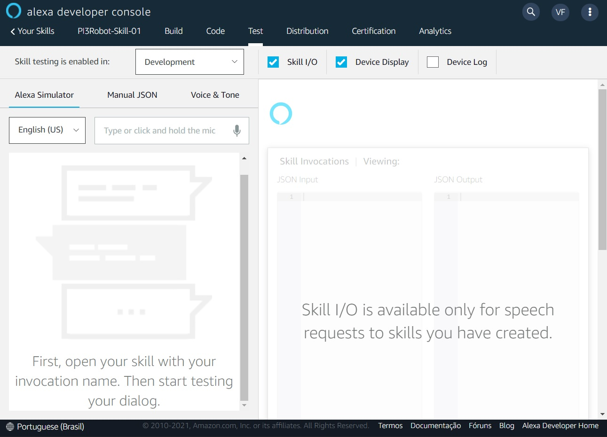
</p>

A opção `Skill testing is enabled in:` deve ser posta em `Development` para habilitar o envio de mensagens. Mantenha a linguagem em `English (US)` e a opção de inserção de dados em `Alexa Simulator`. No campo `Type or click and hold the mic` deve ser escrita a mensagem para simular a voz do usuário, seguindo os parâmetros determinados previamente.

Retornando ao AWS IoT Core, verifique a aba esquerda e busque as opções `Testar`e `Cliente de teste MQTT`. Neste menu é possível escolher se o cliente de testes enviará ou receberá mensagens de determinado tópico comandado por _things_ registrados na conta. Será testado o envio das mensagens MQTT com destino ao robô, logo é preciso agir como um _subscriber_ -- portanto selecione `Assinar um tópico` e preencha o `Filtro de tópicos` com o mesmo nome de tópico utilizado na função Lambda. Para exibir o resulado em um formato sem erros, abra o sub-menu `Configuração adicional` e na opção `Exibição da carga útil MQTT` selecione `Exibir cargas úteis como strings (mais preciso)`. Por fim confirme com o botão `Inscrever-se`.

<p align="center">
    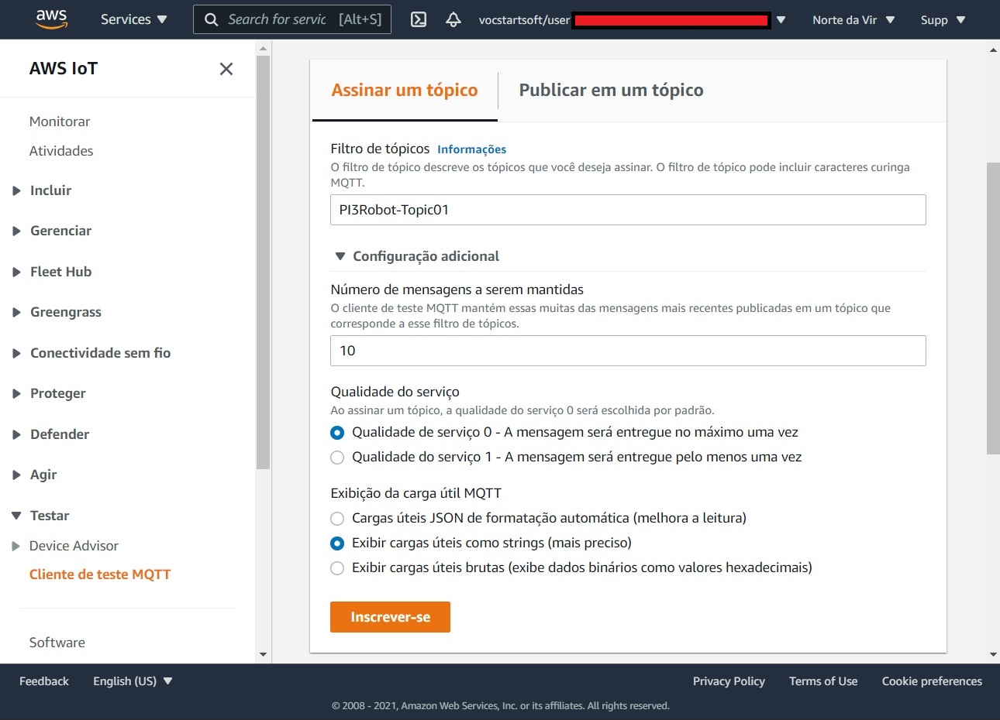
</p>

### Execução do teste

Após se configurar as duas plataformas é possível iniciar o teste. São colocadas à prova duas conexões: entre Alexa e função Lambda, entre função Lambda e IoT _thing_; elas serão conferidas nos consoles da Alexa e do AWS IoT Core respectivamente.

Na ferramenta de testes do Alexa Developer Console, escreva um comando de voz no molde citado anteriormente, iniciando pelo primeiro _intent_ abordado:

- `Alexa, ask robot one to move forward`

<p align="center">
    
</p>

O ambiente de teste deve se conectar à função Lambda e executar os comandos definidos no tratamento do _intent_. Isto prevê a emissão de mensagem MQTT ao _broker_ mas também um retorno ao dispositivo, visto aqui como a resposta `Ok, move forward`. Configura-se assim a correta formação destes dois componentes.

Avaliando o ambiente de teste do AWS IoT Core deve se obter a entrega de um pacote com palavra-chave referente ao _intent_. Como dito anteriormente, o enunciado `move forward`se refere ao _intent_ `MoveForwardIntent`, cujo handler na função Lambda emite mensagem MQTT com conteúdo `forward`. O aparecimento deste pacote sinaliza a correta ligação entre todos os componentes.

<p align="center">
    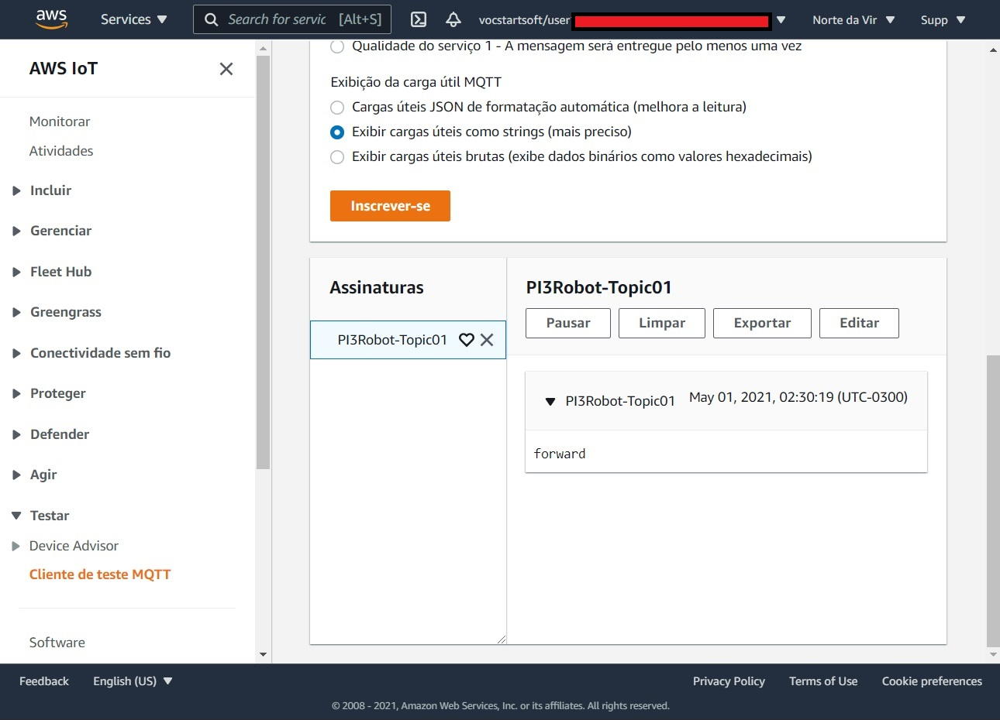
</p>

Continue os testes para cada comando criado, para verificar o funcionamento completo antes da simulação do robô.

<p align="center">
    
</p>

<p align="center">
    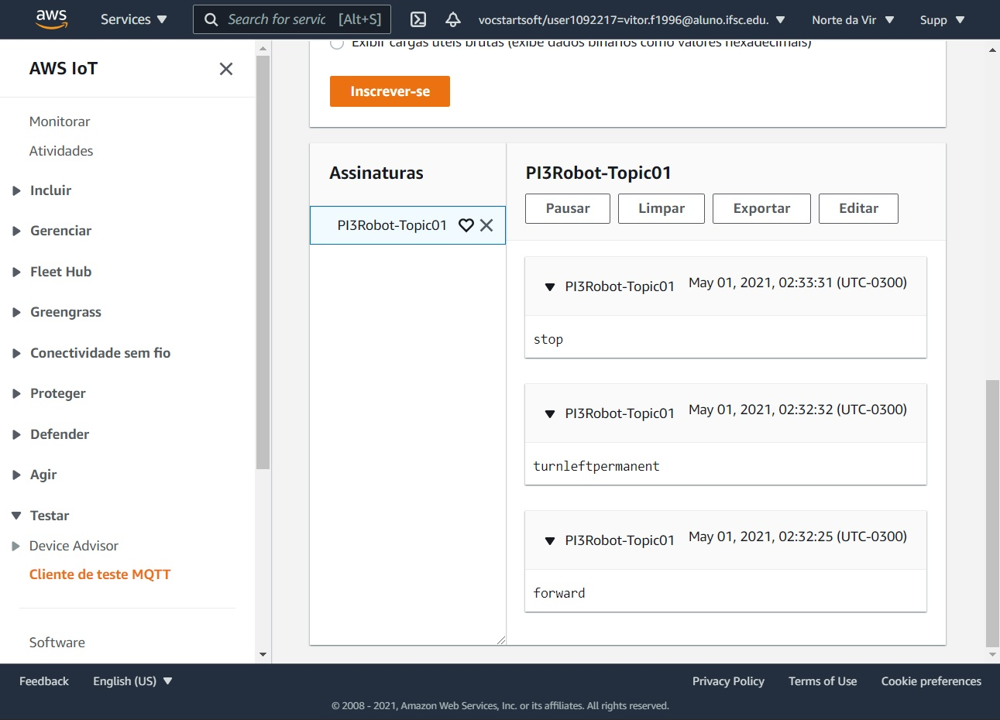
</p>

## Falhas frequentes - _Troubleshooting_

É possível que aconteçam erros na escrita da _skill_ Alexa e da função Lambda, por se tratar de processos com várias etapas envolvidas e replicação de passos. A seguir discute-se os principais equívocos a se cometer:

- **Alexa reconhece _intent_ errado**: a _skill_ é forçada a reconhecer a frase comunicada como algum dos _intents_. Para o exemplo a seguir o _intent_ `TurnRightPermanentIntent` foi excluído do sistema. Ao recebê-lo o dispositivo o reconheceu como `TurnRightIntent`, que possui o enunciado mais semelhante. Em seguida foi enviado um enunciado totalmente desconexo de qualquer um programado, o que também foi reconhecido como um _intent_. Se os testes apontam que o dispositivo não reconhece um _intent_ específico, verifique se ele foi criado e configurado corretamente.
	<p align="center">
    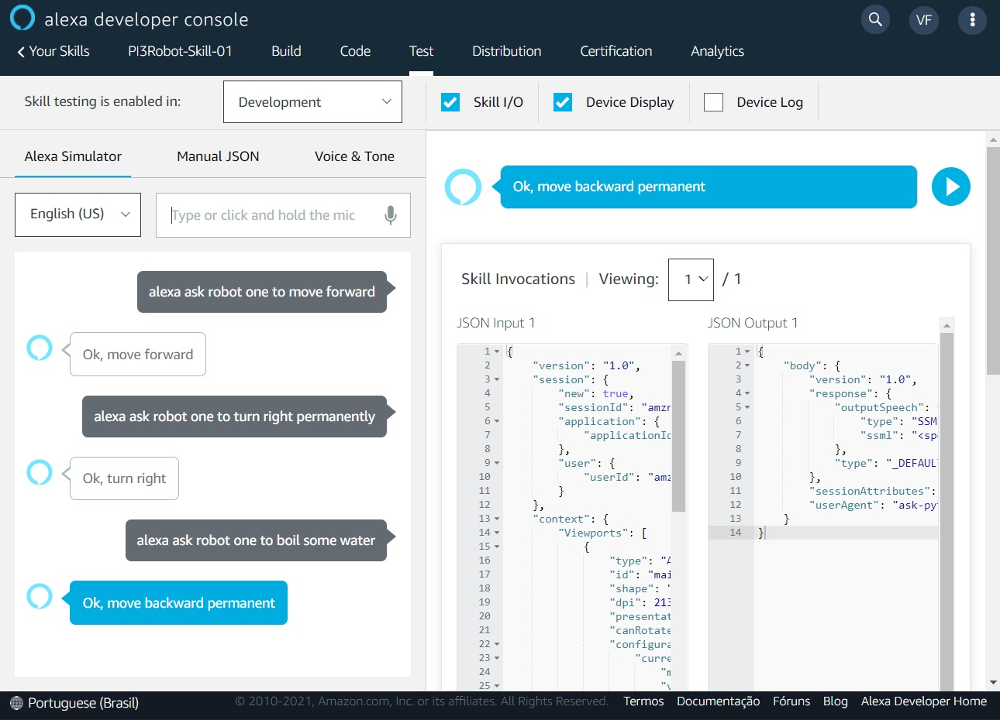
	</p>

- **Alexa responde "_Sorry, I had trouble doing what you asked. Please try again_"**: o _intent_ específico não foi reconhecido pela função Lambda. Isto pode ocorrer por desencontro do nome do _intent_ entre os dois consoles, como algum erro de digitação na classe, ou por falta da função `sb.add_request_handler()` referente a tal comando ao final do código.
	<p align="center">
    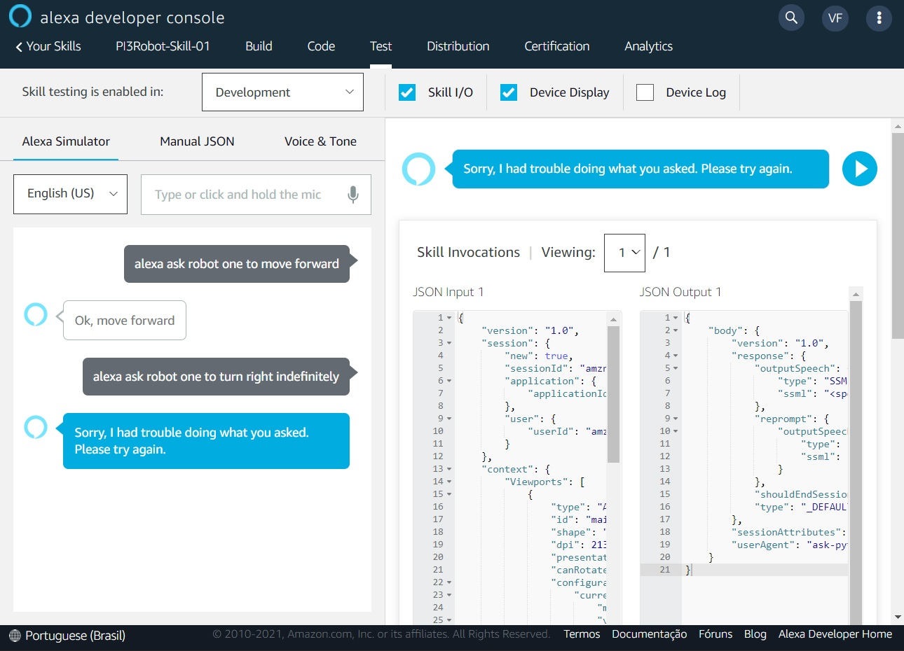
	</p>

- **Alexa responde "_There was a problem with the requested skill's response_"**: ocorre quando há algum erro de sintaxe na função Lambda. Nenhum comando no console Alexa terá sucesso. Revise sua função Lambda completamente, atentando-se principalmente a esses detalhes:
	- Erro de digitação em alguma parte do arquivo `lambda_function.py`;
	- Declaração errada do endereço dos certificados;
	- IoT _thing Endpoint_ errado;
	- Pasta `certificates` e respectivos arquivos não incluídos corretamente;
	- Pasta `AWSIoTPythonSDK` e respectivos arquivos não incluídos corretamente;
	<p align="center">
    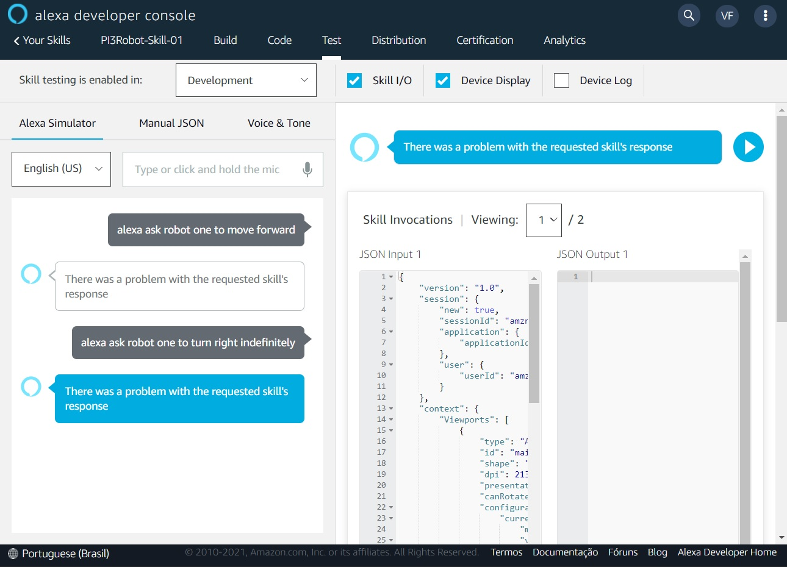
</p>

- **Alexa responde corretamente mas ferramenta de teste MQTT não apresenta o pacote**: a comunicação entre a _skill_ Alexa e a função Lambda acontece sem problemas e o arquivo `lambda_function.py` possui endereço de IoT _thing Endpoint_ válido, caso contrário o problema seria do caso anterior. Tenha certeza de que o _Endpoint_ é referente a um IoT _thing_ cadastrado na conta AWS do desenvolvedor. Se o cliente de teste MQTT ainda não apresenta o recebimento do pacote enviado pela função Lambda, verifique se este está inscrito no tópico correto, com nome igual ao `iotTopic` no arquivo `.PY` da função.

## Exploração do ambiente AWS RoboMaker e código de controle do robô

Um dos mais potentes instrumentos do conglomerado AWS para este projeto é a plataforma AWS RoboMaker. Refere-se a um serviço de elaboração e controle de aplicações robóticas, com suporte para simulação e implementação em larga escala. Seu uso facilita o processo de criação de um robô por fornecer ferramentas prontas e adequadas à situação, poupando trabalho em fases problemáticas, desviando a carga computacional da máquina do desenvolvedor e agrupando tarefas relacionadas a diferentes etapas do desenvolvimento.

### Ferramentas do AWS RoboMaker

O AWS RoboMaker tem como princípio a reunião de aparatos para todo o desenvolvimento do _software_ de um robô. É possível elaborar um algoritmo de controle, testá-lo e enviá-lo a uma placa ligada à conta AWS do desenvolvedor, que irá qualificar o funcionamento do robô de maneira remota. Para isso o AWS RoboMaker oferece o seguinte ferramental:

- **Ambiente de desenvolvimento**: a aplicação robótica desenvolvida será levada a um sistema operacional embarcado em um robô físico, no caso deste projeto em uma placa Raspberry Pi 3. Com o AWS RoboMaker é possível criar uma máquina virtual (_Virtual Machine_ - VM) hospedada em nuvem com uma estrutura completa voltada ao desenvolvimento de robôs, o que poupa muito trabalho e evita erros na configuração do ambiente. Esta VM possui programas para editar, compilar e ativar o código a ser utilizado pelo robô por meio de terminais da mesma forma que se faria no sistema embarcado.

- **Criação de mundos**: um "mundo" é o ambiente material visto durante a simulação do robô. Pode servir para mostrar como o aparelho se comporta em relação ao ambiente e a objetos. 

- **Ambiente de simulação**: o AWS RoboMaker oferece uma suite com _softwares_ de simulação robótica, capazes de representar sistemas mecânicos, sensores eletrônicos e comunicação externa de um aparelho. Novamente obtém-se a vantagem de receber uma estrutura previamente ajustada para o trabalho com elementos do AWS. 

- **Gerenciamento de frotas**: em termos industriais ou de larga escala, a ferramenta de gerenciamento de frotas é a mais importante e insubstituível do AWS RoboMaker. Trata-se de aparatos para o gerenciamento de robôs reais, com a possibilidade de envio de novas aplicações ou atualizações remotamente a conjuntos numerosos de aparelhos, além de permitir monitorar o funcionamento destes na plataforma AWS.

Os dois principais recursos utilizados neste projeto são os ambientes de desenvolvimento e simulação. Antes de se abordar o código de controle do robô é preciso contextualizar-se sobre o _software_ Robot Operating System (ROS), um programa _open source_ de controle de aplicações robóticas. Apesar do nome, não se trata de um sistema operacional - este é operado em cima de alguma distribuição Linux ou de Windows. A máquina virtual criada pelo AWS RoboMaker já integra o ROS e seus tutoriais ensinam os comandos necessários pra fazer seu uso. 

Por não ser uma ferramenta trivial ou de entendimento rápido, é recomendado ler a respeito do ROS e compreender seu conceito. Os seguintes _links_ podem ser bons pontos de partida:
- [ROS Wiki - What is ROS?](http://wiki.ros.org/ROS/Introduction)
- [The Robotics Back-End - What is ROS?](https://roboticsbackend.com/what-is-ros/#What_is_ROS)
- [AWS Open Source Blog - The Open Source Robot Operating System (ROS) and AWS RoboMaker](https://aws.amazon.com/pt/blogs/opensource/open-source-robot-operating-system-ros-aws-robomaker/)

### Ambiente de desenvolvimento

A criação de um ambiente de desenvolvimento no AWS RoboMaker utiliza recursos de hospedagem e _setup_ de VM em nuvem, mas este processo é automatizado e não oferece contratempos. Deve se iniciar pela acesso ao `AWS RoboMaker` por meio do _AWS Management Console_. Após isso escolha a opção `Ambientes de desenvolvimento`, dentro de `Desenvolvimento` no menu à esquerda. Clique em `Criar ambiente de desenvolvimento`.

<p align="center">
	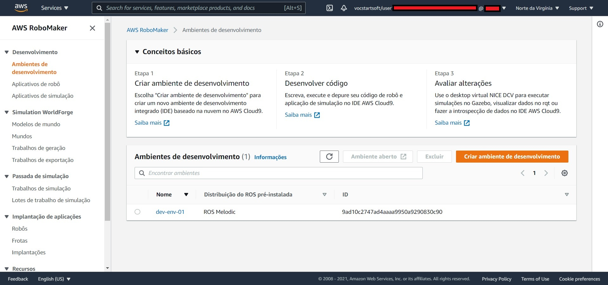
</p>

Conforme a figura a seguir, defina os campos:
- **Nome**: preencha com um nome para a máquina virtual. É recomendável utilizar um nome de fácil distinção, mas este não será utilizado em nenhum documento;
- **Distribuição do ROS pré-instalada**: escolha `ROS - Melodic`, para acompanhar este tutorial e os demais utilizados pelo autor;
- **Tipo de instância**: escolha `t2.micro`. Trata-se das configurações de memória RAM e CPU da máquina virtual. É escolhida a opção mais básica para adequar-se ao caráter gratuito para estudantes;
- **VPC e Subredes**: mantenha as opções dadas por padrão pelo console.

Clique em `Criar`.

<p align="center">
	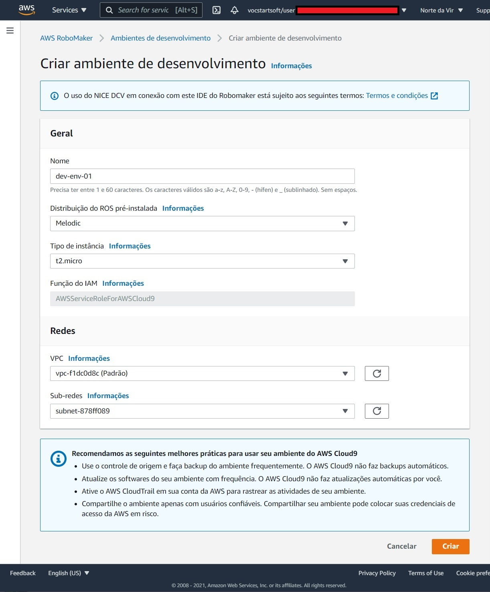
</p>

O ambiente de desenvolvimento será aberto automaticamente e carregado em poucos minutos, com um terminal da VM acessível na parte de baixo da tela e um sistema de arquivos vazio.

### Código de controle do robô

O funcionamento de uma aplicação robótica em ROS se dá por "_packages_", o que facilita constituir partes diferentes do controle do mesmo robô com segurança e intercomunicação. Estes pacotes possuem formatos e documentos definidos, portanto por simplicidade e para evitar erros utiliza-se como base o exemplo `Hello World` fornecido. No ambiente de desenvolvimento aberto, busque o menu superior, escolha `Resources`, `Download Samples` e clique em `Hello World`. O sistema de arquivos do exemplo será baixado.

<p align="center">
	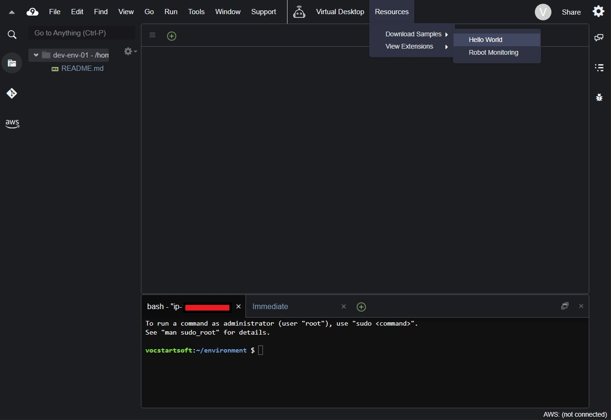
</p>

Dentro deste diretório estão as aplicações robótica e de simulação, nas pastas `robot_ws` e `simulation_ws` respectivamente. Devem ser criados e adaptados arquivos na primeira, mas a segunda não será alterada pois será utilizado o mundo "vazio" dado por padrão. 

O principal arquivo a se abordar é o algoritmo de controle do robô. O arquivo `Python` a ser executado pelo ROS é denominado um "nó" (_node_), encontrado na pasta `robot_ws/src/hello_world_robot/nodes`. O exemplo fornece um código genérico que faz o robô girar em torno do próprio eixo vertical, com o arquivo `rotate`.

> É possível que este arquivo surja com a extensão `.py` em seu nome.

Embora o algoritmo de controle possa ser desenvolvido por cima do arquivo anteriormente citado, é proveitoso criar um novo. Clique com o botão direito sobre a pasta `robot_ws/src/hello_world_robot/nodes`, escolha `New File` e determine um nome - neste projeto utilizou-se o nome `listener`. 

O conteúdo do arquivo é exibido na pasta [AWS RoboMaker](AWS%20RoboMaker/). Este código foi desenvolvido a partir das recomendações [deste tutorial](https://aws.amazon.com/pt/blogs/robotics/build-alexa-controlled-robot/), com as devidas adequações ao uso deste projeto.

<p align="center">
	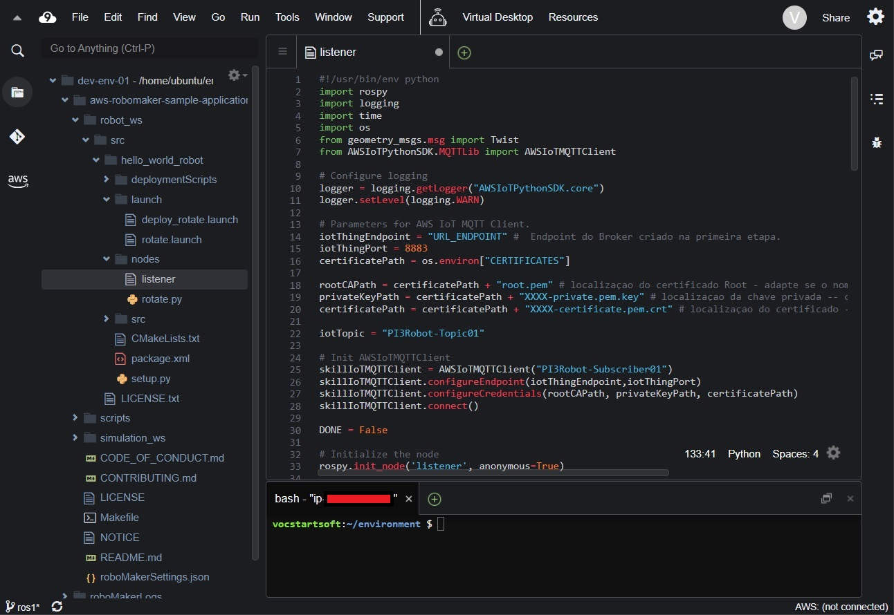
</p>

 São destacáveis os seguintes pontos:
- `iotThingEndpoint`, `privateKeyPath` e `certificatePath` devem ser corrigidos em função do projeto do desenvolvedor da mesma forma que a função Lambda;
- O movimento do robô é comandado com uso das funções `Twist`. Esta aplicação robótica descreve o uso de um robô chamado Turtlebot 3 na simulação, que conta com um componente à parte para acionar os motores. Esta biblioteca é responsável por fazer uma abstração de _hardware_, de forma que não seja necessário qualquer tipo de contato com pinagem ou PWM nesta etapa.
- O tratamento da mensagem MQTT recebida se dá na função `customCallback`. É feita uma checagem sobre o conteúdo do pacote e em função disso é dada uma instrução de movimento. Abaixo segue o exemplo para o comando de voz para movimento limitado à frente (`MoveForwardIntent`), caracterizado pelo início e término do deslocamento linear no eixo _X_ da carcaça.

```Python
if command == "forward":
	twist = Twist()
	twist.linear.x = 1
	cmd_pub.publish(twist)
	time.sleep(1)
	twist.linear.x = 0
	cmd_pub.publish(twist)
```

### Arquivos auxiliares

Assim como na função Lambda, é necessário adicionar ao sistema a pasta de certificados. Paralela à `robot_ws/src/hello_world_robot/nodes`, crie no diretório `robot_ws/src/hello_world_robot` uma pasta chamada `certificates`, clicando nesta com o botão direito, escolhendo `New folder` e alterando o nome. Copie/mova os arquivos de certificado salvos no seu computador a essa pasta no navegador.

Cumprindo o formato de _packages_, o nó `listener` requer um segundo arquivo para ser executado, chamado _Launch file_. Este deve ser criado na pasta `robot_ws/src/hello_world_robot/launch` com o nome `listener.launch`. Insira neste arquivo o código a seguir (também visto na pasta [AWS RoboMaker](AWS%20RoboMaker/)).
```XML
<launch>
    <!-- 
       Using simulation time means nodes initialized after this
       will not use the system clock for its ROS clock and 
       instead wait for simulation ticks. 

       See http://wiki.ros.org/Clock

       Note: set to false for deploying to a real robot.
  -->
  <arg name="use_sim_time" default="true"/>
  <param name="use_sim_time" value="$(arg use_sim_time)"/>

<!-- Start MQTT listener on launch -->
  <node name="listener" pkg="hello_world_robot" type="listener" output="screen">
            <env name="CERTIFICATES" value="$(find hello_world_robot)/certificates/" />
  </node>
</launch>
```
> Note que a variável `type="listener"` informa o nome do arquivo portador do código de controle, `listener`. Adeque os dados no caso de um nome diferente ou a presença da extensão `.py`. 

Outros arquivos padrões da aplicação robótica devem ser alterados para garantir o correto funcionamento do _package_, sendo eles `package.xml`, `CMakeLists.txt` e `21-aws-iot-pip.yaml`.

Os dois primeiros são encontrados na pasta `robot_ws/src/hello_world_robot`. O arquivo `package.xml` necessita apenas da inclusão de uma linha, referente à dependência da biblioteca `AWSIoTPythonSDK`, vista a seguir. Esta deve ser colada junto dos outros comandos `<depend>`. Optou-se por colocá-la logo abaixo da dependência `rospy`.

```XML
<depend>awsiotpythonsdk-pip</depend>
```

O arquivo `CMakeLists.txt` requer a adição de dois dados na seção `# Install`, nas duas primeiras chamadas. A seguir está a escrita completa das duas funções adaptadas, a se substituir no código. Novamente o nome do arquivo `listener` mostra-se em `nodes/listener` e deve ser adequado no caso de variações.

```Makefile
################################################################################
# Install
################################################################################

catkin_install_python(PROGRAMS
	nodes/rotate.py
	nodes/listener		# Adicione essa linha
	DESTINATION ${CATKIN_PACKAGE_BIN_DESTINATION}
)

install(DIRECTORY launch certificates		# Adicione a palavra `certificates` após `launch`
	DESTINATION ${CATKIN_PACKAGE_SHARE_DESTINATION}
)
```

Por último deve ser criado um arquivo para a devida importação da biblioteca AWSIoTPythonSDK ao ROS. Este passo foi dado com o auxílio do guia [Documentation on common colcon bundle scenarios](https://github.com/colcon/colcon-bundle/issues/121). Realize os seguintes passos:
- Abra um novo terminal;
- Digite os seguintes comandos:
	```
	$ cd /etc/ros/rosdep/sources.list.d/
	$ sudo touch 21-aws-iot-pip.yaml
	$ sudo vi 21-aws-iot-pip.yaml
	```
	- Será criado o arquivo `21-aws-iot-pip.yaml` na pasta de fontes do ROS e aberto com o editor `vi`. O terminal agora estará em modo de edição de texto.
- Clique `a` para entrar em modo de escrita;
- Insira o código a seguir no editor de texto:
	```yaml
	awsiotpythonsdk-pip:
        ubuntu:
                pip:
                        packages: [AWSIoTPythonSDK]
	```
	>Atente-se à indentação de 1 _tab_ a mais a cada linha, a cópia/cola de texto no editor pode desformatá-lo.	
- Clique `Esc` para sair do modo escrita;
- Digite `:wq!` e clique `Enter` para salvar o arquivo e sair do editor de texto `vi`;
- Execute o seguinte comando para retornar ao diretório inicial do terminal:
	```
	$ cd -
	```

## Simulação do robô no AWS RoboMaker

A partir deste ponto todos os arquivos estão corretamente ajustados para a simulação. Antes de se realizar a simulação com dispositivo gráfico e todo o processamento de questões físicas, o que demanda certo tempo, é possível verificar o funcionamento da aplicação robótica e sua conectividade com as etapas anteriores.

Comandos (novo terminal):
```
$ cd aws-robomaker-sample-application-helloworld/simulation_ws/
$ rosdep update
$ rosdep install --from-paths src --ignore-src -r -y
$ colcon build
$ colcon bundle

$ cd ../robot_ws/
$ rosdep update
$ rosdep install --from-paths src --ignore-src -r -y
$ colcon build
$ colcon bundle
```

```
$ source install/setup.sh
$ roslaunch hello_world_robot listener.launch
```
